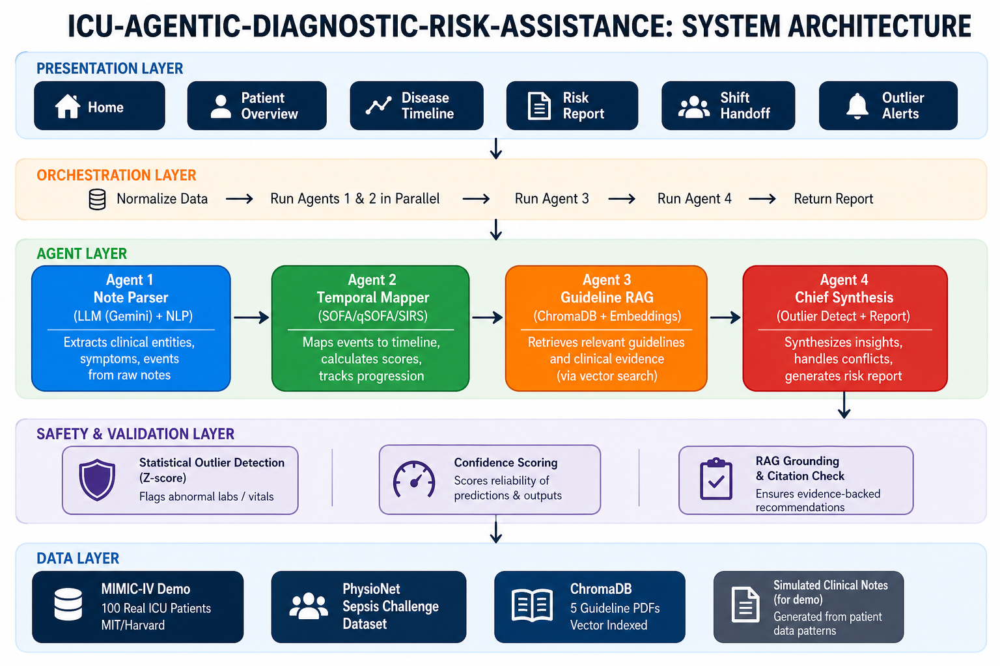

# ICU-Agentic-Diagnostic-Risk-Assitance

A multi-agent AI pipeline for early detection of sepsis and organ failure in ICU patients.

---

## ⚠️ Disclaimer

All outputs generated by this system are **decision-support only**. They do not constitute a clinical diagnosis and must not be used as a substitute for professional medical judgment. Every generated report includes mandatory safety caveats enforced at the system level.

---

## 🧠 Problem Statement

In fast-paced ICU environments, patients generate vast amounts of fragmented clinical data daily — continuously shifting lab results, changing vital signs, and unstructured notes written by different specialists across different shifts.

Critical deterioration patterns — such as the early onset of sepsis — are often missed **not because the data does not exist**, but because no single physician has the time or computational capacity to synthesize all historical and real-time signals simultaneously.

Shift changes introduce additional risk, as incoming clinicians inherit complex patient histories without full context. The result is **delayed intervention for conditions where hours — sometimes minutes — determine survival outcomes**.

---

## 🔬 Research & Clinical Background

### Sepsis — Why Early Detection Matters

* Sepsis is a life-threatening organ dysfunction caused by a dysregulated host response to infection.
* The **Sepsis-3 definition** (Singer et al., JAMA 2016) uses the SOFA score as the primary clinical criterion.
* **qSOFA** (quick SOFA) is a bedside tool for rapid risk stratification: altered mentation, respiratory rate ≥22/min, systolic BP ≤100 mmHg.
* For every hour of delayed antibiotic administration in septic shock, mortality increases by approximately 7%.

### Key Lab Markers We Track

| Marker         | Clinical Significance                                                     |
| -------------- | ------------------------------------------------------------------------- |
| Lactate        | Tissue hypoperfusion; >2 mmol/L = concern, >4 = critical                  |
| WBC            | Leukocytosis (>12k) or leukopenia (<4k) = systemic response               |
| Creatinine     | Acute kidney injury (AKI) — rising trend is an early organ failure signal |
| Bilirubin      | Hepatic dysfunction component of SOFA                                     |
| Platelet Count | Coagulopathy, declining trend = DIC risk                                  |
| MAP            | Mean arterial pressure <65 mmHg = hemodynamic compromise                  |
| PaO2/FiO2      | Respiratory SOFA component                                                |

### The Hallucination Problem in Clinical AI

LLMs can confabulate — generating plausible-sounding but fabricated clinical citations or overstating risk. In a clinical context, this is not a UX problem. It is a **patient safety problem**. Our architecture addresses this through a multi-layer verification strategy described below.

---

## 🏗️ Proposed Solution

**ICU Agentic Diagnostic Risk Assistant** is a multi-agent AI pipeline that ingests a patient's full ICU history — structured vitals, lab results, and unstructured clinical notes — and produces a **Diagnostic Risk Report** with:

* A chronological disease progression timeline
* Flagged early warning signs of sepsis or organ failure
* Citations to specific clinical guidelines supporting each flag
* Outlier detection that refuses to update diagnosis on statistically anomalous lab values
* Explicit safety caveats on every output
* Lab error refusal, flagging emerging new symptoms
* 3 Cross referencing methods
* Providing a confidence score for extracted symptoms from hybrid inputs
* Eliminating black box concept by providing transparency and rejecting solutions instead of just flagging them while giving evidence and justification
* Providing risk score graphs

---

## 🧩 System Architecture

<p align="center">
  
</p>

### Agent Layer

| Agent                         | Role                                                                                                 | Input                              | Output                                          |
| ----------------------------- | ---------------------------------------------------------------------------------------------------- | ---------------------------------- | ----------------------------------------------- |
| **Note Parser Agent**         | Extracts symptoms, events, medications, and specialist observations from unstructured clinical notes | Raw clinical notes (text)          | Structured event list with timestamps           |
| **Temporal Lab Mapper Agent** | Builds a chronological trend map from structured lab and vitals data; flags directional shifts       | Lab results, vitals CSVs           | Annotated timeline with trend markers           |
| **Guideline RAG Agent**       | Retrieves and cites exact clinical guideline passages supporting each flagged finding                | Flagged findings from other agents | Cited guideline excerpts with source references |
| **Chief Synthesis Agent**     | Integrates all agent outputs; runs outlier detection; resolves conflicts; generates final report     | All agent outputs                  | Diagnostic Risk Report                          |

---

## Twist 1: Family Communication

The diagnostic report is packed with clinical jargon. The Family Communication tab produces a **compassionate, jargon-free summary** of the patient's last 12 hours:

* Written as if explaining to a non-medical family member
* Translated into **English + a regional language** (Hindi, Tamil, Bengali, Telugu, and 11 more)
* Default language is English; select a second language from the dropdown
* Includes simplified risk status and diagnosis hold explanations
* Print-friendly version for sharing

---

## Twist 2: Diagnosis Hold

When a new lab result **contradicts 3 days of consistent data**, the system:

1. Detects the statistical outlier (Z-score > 3 standard deviations)
2. Verifies the prior 72 hours were consistent (coefficient of variation < 25%)
3. Flags it as a probable mislabeled/erroneous result
4. **REFUSES** to revise the diagnosis until a confirmed redraw is received
5. Excludes the anomalous value from all risk calculations
6. Shows a red **DIAGNOSIS HOLD** banner on the dashboard

---

## Data Layer

| Component                   | Role                                                                                                      |
| --------------------------- | --------------------------------------------------------------------------------------------------------- |
| **MIMIC-III Data Loader**   | Ingests MIMIC-III demo CSVs (admissions, labs, notes, vitals) and normalizes schema                       |
| **Patient Context Builder** | Assembles a single patient's full record into a structured object passed to all agents from varied inputs |
| **Guideline Corpus Loader** | Loads, chunks, and embeds clinical guideline PDFs (Sepsis-3, SOFA, qSOFA, AKI, KDIGO)                     |
| **Vector Store**            | Indexes embedded guideline chunks for semantic retrieval (ChromaDB / FAISS)                               |

---

## Project Structure

```text
ICU-Agentic-Diagnostic-Risk-Assistance/
  app.py
  requirements.txt
  .env
  README.md
  download_sepsis.py
  run.bat
  setup.bat
  
  pages/
    1_Patient_Overview.py
    2_Disease_Timeline.py
    3_Risk_Report.py
    4_Shift_Handoff.py
    5_Outlier_Alerts.py
    6_Family_Communication.py
  
  backend/
    config.py
    orchestrator.py
    requirements.txt
    agents/
      note_parser.py
      temporal_mapper.py
      guideline_rag.py
      chief_synthesis.py
    utils/
      sofa_calculator.py
      outlier_detector.py
    data/
      ingestion.py
      note_generator.py
    rag/
      vector_store.py
    models/
      patient.py
  
  data/
    mimic/
    guidelines/
    chroma_db/
```

---

## Tech Stack

| Component      | Technology                             | Cost      |
| -------------- | -------------------------------------- | --------- |
| LLM            | Google Gemini 2.0 Flash                | Free      |
| Frontend       | Streamlit 1.40                         | Free      |
| Vector DB      | ChromaDB 0.5                           | Free      |
| Embeddings     | SentenceTransformer (all-MiniLM-L6-v2) | Free      |
| Clinical Data  | MIMIC-IV Demo (MIT/Harvard)            | Free      |
| Visualization  | Plotly 5.24                            | Free      |
| PDF Export     | fpdf2                                  | Free      |
| **Total Cost** |                                        | **Rs. 0** |

---

## Anti-Hallucination Strategy

The system uses **6 independent layers** to prevent hallucination:

1. **RAG with strict grounding**
2. **Citation Verifier**
3. **Structured JSON outputs**
4. **Deterministic outlier detection**
5. **Confidence scoring as a trust gate**
6. **Locked prompt templates**

---

## Dataset

### MIMIC-III Clinical Database Demo

* Open-access demo subset of the MIMIC-III database (PhysioNet)
* Includes: admissions, ICU stays, lab events, chart events (vitals), clinical notes
* Used for patient data simulation in this project
* Full MIMIC-III access requires credentialed PhysioNet account

### Clinical Guideline Corpus

* Sepsis-3 definition and management guidelines
* SOFA and qSOFA scoring criteria
* KDIGO AKI staging guidelines
* Surviving Sepsis Campaign (SSC) 2021 guidelines

---

## 🏃 Sprint Plan

### Sprint 1 — Foundation (Hours 0–4)

**Goal:** Data in, guidelines embedded, queryable.

### Sprint 2 — Agent Layer (Hours 4–11)

**Goal:** Three independent agents producing structured outputs.

### Sprint 3 — Chief Agent + Safety Layer (Hours 11–16)

**Goal:** Full pipeline runs end-to-end with safety guarantees.

### Sprint 4 — Output + Demo Polish (Hours 16–20)

**Goal:** A live demo a judge can interact with.

---

## 👥 Team

**Leader:** Sanjana Jail
**Members:**

* Jinesha Gandhi
* Anushka Garud
* Rutuja Shelke

---

## Citations

[1] C. Stylianides et al., "AI Advances in ICU with an Emphasis on Sepsis Prediction," Healthcare, vol. 7, no. 1, 2025.

[2] A. Amirsavadkouhi and S. B. Mirtajani, "The Role of Artificial Intelligence in the Prediction, Diagnosis, and Management of Sepsis in the Intensive Care Unit," Medical Research Archives, vol. 13, no. 2, 2025.

[3] G. H. Abbas et al., "Artificial Intelligence-Based Predictive Modeling for Early Sepsis Detection in Hospitalized Patients," Critical Care Explorations, vol. 7, no. 12, 2025.

---

## 📄 License

This project is built for hackathon purposes. Clinical guideline content belongs to their respective publishing organizations. MIMIC-III data is used under the PhysioNet open-access demo license.

**IGNISIA AI Hackathon 2026 | HC01 | Built with Gemini AI + MIMIC-IV + Surviving Sepsis Campaign 2021**
